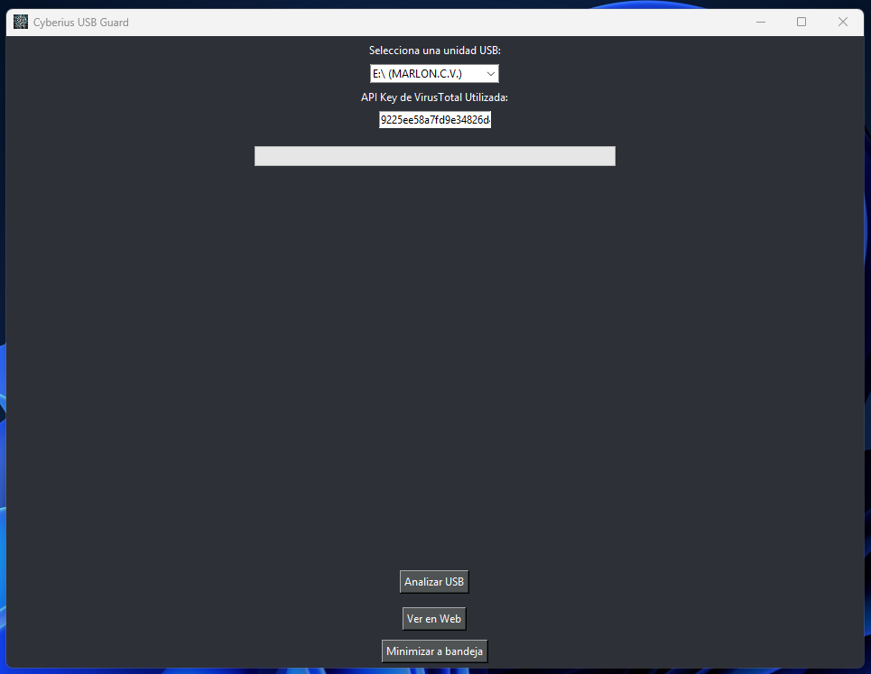
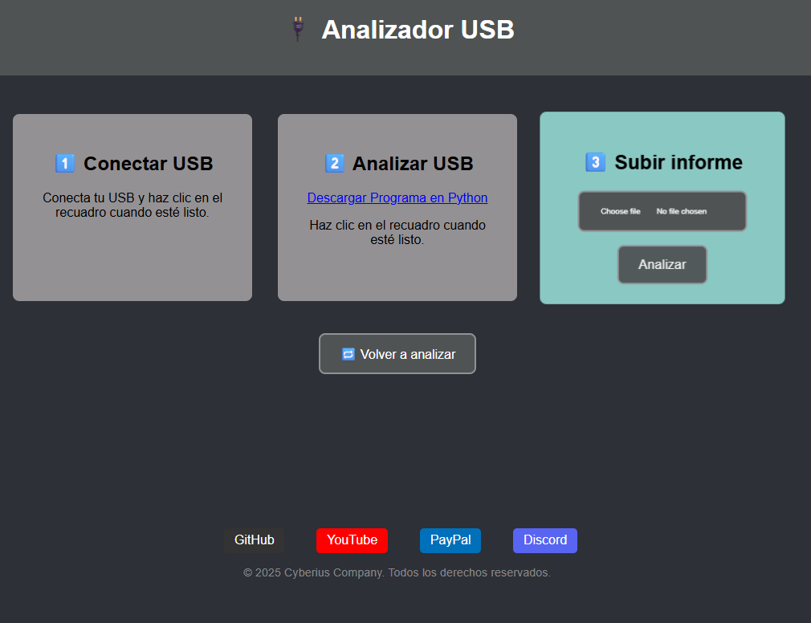

<p align="center">
  <a href="README.md">
    
    <strong>Español</strong>
  </a>
  &nbsp;|&nbsp;
  
  <strong>English</strong>
  &nbsp;|&nbsp;
  <a href="https://www.youtube.com/watch?v=xvFZjo5PgG0&list=RDxvFZjo5PgG0&start_radio=1&pp=ygUTcmljayByb2xsaW5nIG5vIGFkc6AHAQ%3D%3D">
    
    <strong>日本語</strong>
  </a>
</p>

# CyUSBGuard

USB analysis tool with VirusTotal API integration and background monitoring capabilities.

- DeepWiki: https://deepwiki.com/cyberiuscompany/CyUSBGuard

---

<p align="center">
  
</p>

---

## Tool Screenshots

<h2 align="center">Main Menu</h2>
<p align="center">
  
</p>

<h2 align="center">Web Report Option</h2>
<p align="center">
  
</p>

<h2 align="center">Background Options</h2>
<p align="center">
  
</p>

<h2 align="center">Running in Background</h2>
<p align="center">
  
</p>

<h2 align="center">Web Scan Result</h2>
<p align="center">
  
</p>

<h2 align="center">Local Scan Result</h2>
<p align="center">
  
</p>

<h2 align="center">Detailed Web Report</h2>
<p align="center">
  
</p>

---

## Description

**CyUSBGuard** is a Python-based GUI tool that analyzes connected USB devices. It allows automatic and manual scanning of files using the VirusTotal API.

Built for cybersecurity use in educational, enterprise, or home environments.

## 🚀 Key Features

- Automatic detection of connected USB drives.
- Hash-based file scanning with VirusTotal API.
- Graphical result visualization.
- Use your own API key.
- Passive background scanning (stealth mode).
- HTML and visual report generation.
- Windows compatibility.
- Simple and customizable interface.

## 🧰 Technologies Used

- Python 3.x
- PyQt5
- pystray
- PIL (Pillow)
- requests
- webbrowser
- json

## 📁 Project Structure

```bash
├── cyusbguard.py                  # Main script
├── ver_informe_en_frame.py       # Embedded HTML report view
├── index.html                    # Report HTML
├── config.json                   # Configuration and API Key
├── estilos.css                   # Styling for report
├── script.js                     # JS logic for report
├── icono.png / cyberius.ico      # App icons
├── requirements.txt              # Dependencies
├── README.md                     # This file
```

---

## 📄 Additional Documentation

- [🔐 Security](.github/SECURITY.md)
- [📜 License](LICENSE)
- [🤝 Code of Conduct](.github/CODE_OF_CONDUCT.md)
- [📬 Contributing](.github/CONTRIBUTING.md)
- [📢 Support](.github/SUPPORT.md)
- [⚠️ Legal Notice](DISCLAIMER.md)

---

## ⚙️ 1.1 Basic Installation 🪟 Windows

```bash
git clone https://github.com/cyberiuscompany/CyUSBGuard.git
cd CyUSBGuard
python -m venv venv
.env\Scriptsctivate
pip install -r requirements.txt
python cyusbguard.py
```

## ⚙️ 1.2 Basic Installation 🐧 Linux / macOS

```bash
git clone https://github.com/cyberiuscompany/CyUSBGuard.git
cd CyUSBGuard
python3 -m venv venv
source venv/bin/activate
pip install -r requirements.txt
python3 cyusbguard.py
```

## ⚙️ 2. Professional Package Installation

```bash
git clone https://github.com/cyberiuscompany/CyUSBGuard.git
cd CyUSBGuard
python3 -m venv venv
source venv/bin/activate
pip install -r requirements.txt
pip install .
cyusbguard
```
