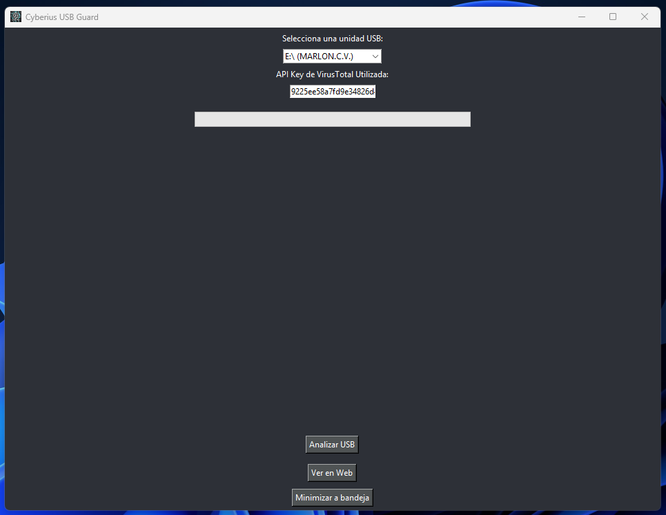

<p align="center">
  
  <strong>Español</strong>
  &nbsp;|&nbsp;
  <a href="README.en.md">
    
    <strong>English</strong>
  </a>
  &nbsp;|&nbsp;
  <a href="https://www.youtube.com/watch?v=xvFZjo5PgG0&list=RDxvFZjo5PgG0&start_radio=1&pp=ygUTcmljayByb2xsaW5nIG5vIGFkc6AHAQ%3D%3D">
    
    <strong>日本語</strong>
  </a>
</p>

# CyUSBGuard

Herramienta de análisis de USBs, con integración mediante API de VirusTotal y funcionamiento en segundo plano.

- DeepWiki de la herramienta: https://deepwiki.com/cyberiuscompany/CyUSBGuard
---

<p align="center">
  
</p

---

## Fotos de Herramienta

<h2 align="center">Menú Principal</h2>
<p align="center">
  
</p>

<h2 align="center">Opción Página Web</h2>
<p align="center">
  
</p>

<h2 align="center">Opciones de Segundo Plano</h2>
<p align="center">
  
</p>

<h2 align="center">Programa en Segundo Plano</h2>
<p align="center">
  
</p>

<h2 align="center">Resultado del Análisis Web</h2>
<p align="center">
  
</p>

<h2 align="center">Resultado del Análisis Local</h2>
<p align="center">
  
</p>

<h2 align="center">Resultado Detallado del Análisis Web</h2>
<p align="center">
  
</p>


## Descripción

**CyUSBGuard** es una herramienta desarrollada en Python con interfaz gráfica que analiza dispositivos USB conectados al sistema, permitiendo realizar escaneos automáticos y manuales de archivos mediante la API de VirusTotal. 

Diseñada con un enfoque de ciberseguridad para entornos educativos, empresariales o domésticos.

## 🚀 Funcionalidades principales

- Detección automática de unidades USB conectadas.
- Escaneo de archivos con hashes y envío a VirusTotal.
- Visualización gráfica de resultados.
- Integración con tu propia clave API.
- Análisis pasivo en segundo plano (modo sigiloso).
- Generación de informes visuales y en HTML.
- Compatibilidad con Windows.
- Interfaz sencilla y personalizable.

## 🧰 Tecnologías utilizadas

- Python 3.x
- PyQt5
- pystray
- PIL (Pillow)
- requests
- webbrowser
- json

## 📁 Estructura del proyecto

```bash
├── cyusbguard.py # Código principal
├── ver_informe_en_frame.py # Vista de informe HTML incrustada
├── index.html # Vista web del informe
├── config.json # Configuración y API Key
├── estilos.css # Estilos de la vista
├── script.js # Lógica JS del informe
├── icono.png / cyberius.ico # Iconos de la app
├── requirements.txt # Dependencias
├── README.md # Este archivo
```
---

## 📄 Documentación adicional

- [🔐 Seguridad](.github/SECURITY.md)
- [📜 Licencia](LICENSE)
- [🤝 Código de Conducta](.github/CODE_OF_CONDUCT.md)
- [📬 Cómo contribuir](.github/CONTRIBUTING.md)
- [📢 Soporte](.github/SUPPORT.md)
- [⚠️ Aviso legal](DISCLAIMER.md)

---

## ⚙️ 1.1 Instalación básica con clonado 🪟 Windows

```bash
git clone https://github.com/cyberiuscompany/CyUSBGuard.git
cd CyUSBGuard
python -m venv venv
.\venv\Scripts\activate
pip install -r requirements.txt
python cyusbguard.py
```

## ⚙️ 1.2 Instalación básica con clonado 🐧 Linux / macOS

```bash
git clone https://github.com/cyberiuscompany/CyUSBGuard.git
cd CyUSBGuard
python3 -m venv venv
source venv/bin/activate
pip install -r requirements.txt
python3 cyusbguard.py
```

## ⚙️ 2 Instalación como si fuese paquete profesional

```bash
git clone https://github.com/cyberiuscompany/CyUSBGuard.git
cd CyUSBGuard
python3 -m venv venv
source venv/bin/activate
pip install -r requirements.txt
pip install .
cyusbguard
```


